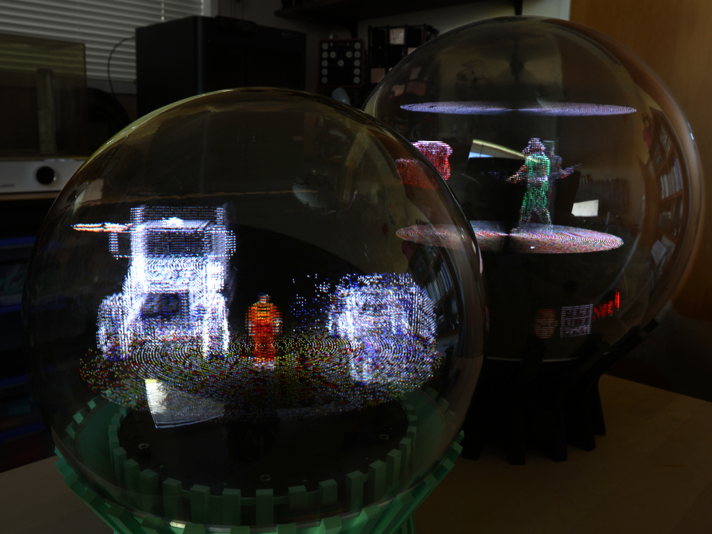
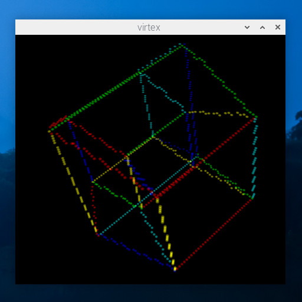

# Multivox

This is the code I currently use to drive my [volumetric displays](https://www.youtube.com/watch?v=pcAEqbYwixU).

It supports two closely related devices which are configured in the `src/driver/gadgets` directory:
- [Rotovox](https://youtu.be/97cLIO7FNtw) is a 400mm Orb featuring two 128x64 panels arranged vertically side by side.  
- [Vortex](https://youtu.be/Ozzpirkhi5c) is a 300mm Orb featuring two 128x64 panels arranged horizontally, back to back.

Rotovox has a higher vertical resolution and better horizontal density; Vortex is brighter and has a higher refresh rate.

The 3D printable parts for Vortex are available [here](https://github.com/AncientJames/VortexParts).

## Hardware

This code was originally written for a single display, and the device specific code was later somewhat abstracted
out to support a second similar gadget. There are assumptions about the hardware that are pretty well baked in:

* It consists of two HUB75 LED panels spinning around a vertical axis.
* The panels use either ABCDE addressing or ABC shift register addressing.
* It uses a single GPIO (a photodiode or similar) to sync to rotation - high for 180°, low for 180°.
* It's running on a Raspberry Pi 4.

The GPIO mappings and panel layout are defined in `src/driver/gadgets/gadget_<name>.h`. GPIO is via memory mapped
access - if you're using a different model of Pi you'll need to change `BCM_BASE` in the GPIO code. I haven't tested
this, and you should probably assume it doesn't work.

Input is via a bluetooth gamepad - I've been using an Xbox controller, and the input system is based on the default
mapping for that.

Audio out is also via bluetooth. I haven't had success with the higher quality codecs, but the headset protocol works.

## Layout

There are two parts to this code - the driver, which creates a voxel buffer in shared memory and scans its contents out
in sync with rotation, and the client code which generates content and writes it into the voxel buffer. Both driver
and client code are designed to run on the same device, a Raspberry Pi embedded in the hardware and spinning at several
hundred RPM. There is a demo included in the Python directory which streams point clouds from a PC over wifi to the
device, but fundamentally it's designed as a self contained gadget, like an alternate timeline Vectrex. A bluetooth
gamepad is used to control the demos.

    ├── src
    │   ├── driver
    │   │   ├── gadgets         -- the different volumetric display configurations
    │   │   │   └──             
    │   │   └── vortex.c        -- driver code - creates a voxel buffer in shared memory,
    │   │                          and handles scanning it out to the led panels in sync with
    │   │                          the rotation
    │   ├── simulator
    │   │   └── virtex.c        -- software simulator - presents the same voxel buffer as
    │   │                          the driver would, but renders the contents into an X11 window
    │   │
    │   ├── multivox            -- front end / launcher for the various volumetric toys
    │   │   └──
    │   ├── platform            -- common client code
    │   │   └──
    │   └── toys                -- a collection of volumetric demos using the shared voxel buffer
    │       ├── eighty          -- multiplayer light cycles
    │       ├── fireworks.c     -- cheesy first demo
    │       ├── flight.c        -- some kind of 70s scifi thing
    │       ├── tesseract.c     -- a 4D cubube
    │       ├── viewer.c        -- viewer for .obj and .png files
    │       └── zander          -- lander/zarch/virus-esque
    ├── python  
    │   ├── calibration.py      -
    │   ├── grid.py             -- some pattern generators, useful when calibrating the device
    │   ├── colourwheel.py      -
    │   ├── obj2c.py            -- tool for embedding .obj models in a header file
    │   ├── pointvision.py      -- receive point clouds streamed from vortexstream.py
    │   └── vortexstream.py     -- stream point clouds to pointvision.py
    └── README.md               -- you are here

## Building

On the Raspberry Pi, clone the repository:

    git clone https://github.com/AncientJames/multivox.git

Configure the project for your hardware:

    cd multivox
    mkdir build
    cd build
    cmake -DMULTIVOX_GADGET=vortex ..
    cmake --build .

## Running

First, the driver has to be running:

    sudo ./vortex

When invoked from the command line it periodically outputs profiling information (frame rate, rotation rate), and accepts keyboard input for various diagnostics:

| Key | Effect |
| --- | ------ |
| esc | Exit   |
| b   | Bit depth - cycles through 1, 2 or 3 bits per channel. Higher bit depths result in lower refresh rates |
| u   | Uniformity - cycles through different strategies for trading off brightness against uniformity |
| t   | Trails - adjusts how far back to accumulate skipped voxels when the rotation rate is too high for the refresh rate |
| l   | Lock - whether to adjust the rotation sync to keep it facing one way |
| d D | Drift - rotisserie mode. Introduces some explicit drift to the rotation sync |
| p   | Panel - selectively disable the panels |
| xyz | Axis - When the display isn't spinning, it shows an othographic view. This lets you choose the axis |

While that's running, try one of the toys:

    ./tesseract

The `viewer` takes a list of *.obj* and *.png* files as arguments. You can scale, rotate and so on using the gamepad, and it
also accepts keyboard input when run remotely from the command line.

    ./viewer ~/Multivox/models/*.obj

|Control| Key | Effect |
| ----- | -   | ------ |
|       | esc | Exit   |
| LB/RB |[ / ]| Cycle through models |
| A     |     | Walkthrough / Orbit |
| X     |     | Zoom to fit |
| Y     |     | Toggle wireframe |

## Simulator

If you don't have a physical volumetric display, there's a simulator, `virtex`, which you can run in place of `vortex`. It exposes the same voxel buffer in shared memory, but renders the contents using OpenGL in an X11 window.

Run without command line arguments it creates a display compatible with the currently configured gadget, but there are some options to let you experiment with different geometries:

| Option | Effect |
| ------ | ------ |
| -s X   | slice count - the number of vertical slices per revolution |
| -o X X | offsets - distance the front and back screens are offset from the axis, as a fraction of screen radius |
| -b X   | bits per channel (1 - 3) |
| -w X Y | panel resolution |
| -g X   | scan geometry - radial or linear. Linear looks better, but it's a lot harder to build. |

An idealised device with linear scanning and 3 bits per channel can be invoked like this:

    ./virtex -g l -s 128 -w 1280 1280 -b 3

The simulator is fill rate intensive; if you're running it on a Raspberry Pi you'll probably want to reduce the slice count.

## Installing

If you want it to start up automatically on boot, you can install `vortex` as a service, and set `multivox` to run on startup.

First install everything to its default location `~/Multivox`:

> make install

This will build the executable files and copy them into the destination directory, as well as creating `.mct` files in `~/Multivox/carts` for the built in toys.

Create the driver service:

    sudo nano /usr/lib/systemd/system/vortex.service

and fill in the following information:

    [Unit]
    Description=Vortex Display Driver
    After=multi-user.target

    [Service]
    ExecStart=/home/pi/Multivox/bin/vortex

    [Install]
    WantedBy=multi-user.target

Then start it up:
    
    sudo systemctl daemon-reload
    sudo systemctl enable vortex.service

The driver assigns itself to core 3 - you can add `isolcpus=3` to the end of `/boot/cmdline.txt` to ensure it's the only thing running on that core.

You'll also want the launcher to start up on boot:

    crontab -e

And add the line:

    @reboot /home/pi/Multivox/bin/multivox

## Multivox

If everything goes smoothly, when you turn on the device it will boot up into `Multivox`. This is a fantasy console which
acts as a launcher for all the games and demos you run on the hardware. The bundled toys are automatically installed in
the `~/Multivox/carts/` directory as `.mct` files, and external apps can be launched by adding a `.mct` file containing
its command, path and arguments.

Each `.mct` file appears as a cartridge in the Multivox front end. They should each have a label on the side; at the moment
all you can do to distinguish between them is change their colour in the `.mct`.

When you exit an app back to the launcher, it saves a snapshot of the voxel volume, and this gives a preview of what you'll
see when you launch a cart. This means there are two competing representations of the same information, and any future work
on the front end will probably start with overhauling the entire approach.

Some basic UI for controls such as changing bit depth, rebooting and so on would also be a boon.

|Control| Effect |
| ----- | ------ |
| LB/RB | Cycle through carts |
| A     | Launch cart |
| ⧉    | Exit / resume running cart |
| △ ▽  | Change bit depth
|☰ x5  | Power off |

---
